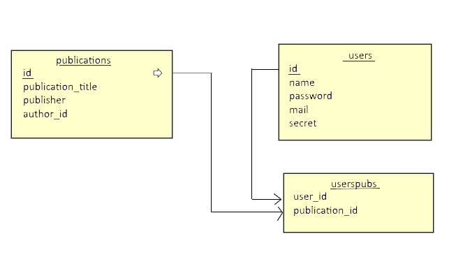

Parts Implemented by Ahmet Bilal Can
================================
Login
-----------------------------
We used user table to work with login operations so user table is generated with following code:

.. code-block:: python

  def create_user_table():
      with dbApi.connect(app.config['dsn']) as connection:
          cursor = connection.cursor()

          query = """DROP TABLE IF EXISTS USERS CASCADE"""
          cursor.execute(query)
          query = """CREATE TABLE USERS (
                  id SERIAL PRIMARY KEY,
                  name VARCHAR(40),
                  password CHAR(120),
                  mail VARCHAR(40),
                  secret VARCHAR(40)
          )"""

          cursor.execute(query)
          connection.commit()
          return True
          
          
In main function at auth.py we get login information and check if it exits in database and correct.If it exits then we create user class instance to work with flask-login plugin.With that instance we log our user to system.After that, if we call current_user we will get object that corresponds to logged in user.Also we store passwords after hashing them.

.. code-block:: python

  def main():
      if request.method == 'POST':

          email_var = request.form.get('email')
          pw_var = request.form.get('password')
          hashed_pw = pwd_context.encrypt(pw_var)

          if check_login(email_var, pw_var):

              with dbApi.connect(app.config['dsn']) as connection:
                  cursor = connection.cursor()

                  cursor.execute("""SELECT id, name, mail FROM USERS
                                  where %s = mail
                                  """, (email_var,))
                  connection.commit()

                  user_info = cursor.fetchone()
                  user = User(user_info)

                  login_user(user)

                  return redirect('/user_pubs')
          else:
              return redirect('/auth')
      return render_template('login.html')
      
We check passwords by the help of pwd_context.verify function which is part of passlib library.

.. code-block:: python

  def check_login(mail_address, pw):
      with dbApi.connect(app.config['dsn']) as connection:
          cursor = connection.cursor()

          cursor.execute("""SELECT password FROM USERS
                          WHERE mail = %s """ , (mail_address,))
          connection.commit()

          password = cursor.fetchone()[0]

          print(pwd_context.verify(pw,password))
          return pwd_context.verify(pw,password)
          
If user dont have account, they can create new one by filling create new account form.

.. code-block:: python

  def create_account(name_, password_, mail_, secret_):
      with dbApi.connect(app.config['dsn']) as connection:
          cursor = connection.cursor()

          cursor.execute("""INSERT INTO USERS (name, password,mail,secret) 
          VALUES(%s,%s,%s,%s)""", (name_, password_, mail_, secret_,))

          connection.commit()

          return True
          

If user forgot his/her password, he/she can get new one.In order to do this following code is used.

.. code-block:: python

  def change_password(new_pw, secret_quest, mail_addres):
    with dbApi.connect(app.config['dsn']) as connection:
        cursor = connection.cursor()

        cursor.execute("""SELECT id FROM USERS
                where %s = mail AND %s = secret
                """, (mail_addres, secret_quest))
        connection.commit()
        user_id_change = cursor.fetchone()

        cursor = connection.cursor()[0]
        if user_id_change:

            cursor.execute("""UPDATE USERS SET password = %s
                    where id = %s   AND mail = %s  """, 
                    (new_pw, user_id_change, mail_addres,))

            connection.commit()
            return True
        else:
            return False
User can delete his/her account.

.. code-block:: python

  def delete_account(password, mail, secret):
  
      with dbApi.connect(app.config['dsn']) as connection:
          cursor = connection.cursor()

          cursor.execute("""SELECT id FROM USERS
                  where mail = %s  AND secret = %s
                  """, (mail, secret))
          connection.commit()
          user_id_delete = cursor.fetchone()

          print(user_id_delete)
          cursor = connection.cursor()
          if user_id_delete:

              cursor.execute("""DELETE FROM USERS where id = %s  """, 
                (user_id_delete,))

              connection.commit()
              return True
          else:
              return False

If user login succesfully, publications page will occur with 2 part.First part is user's following publication and second part is other publications.In order to get user's publications and other publications following code is used.

.. code-block:: python

  def get_publications(user_id):
      with dbApi.connect(app.config['dsn']) as connection:
          cursor = connection.cursor()

          query = """SELECT publication_id, publication_title FROM PUBLICATION 
            WHERE publication_id in(
                  SELECT publication_id FROM USERSPUBS
                  WHERE user_id = %s)
                  """ % user_id

          cursor.execute(query)
          connection.commit()

      return cursor
     
  def get_no_publications(user_id):
  
    with dbApi.connect(app.config['dsn']) as connection:
        cursor = connection.cursor()

        query = """SELECT publication_id, publication_title FROM PUBLICATION WHERE publication_id not in (
                SELECT publication_id FROM USERSPUBS
                WHERE user_id = %s)
                """ % user_id

        cursor.execute(query)
        connection.commit()

    return cursor

And these functions used at user_publication function.

.. code-block:: python
  @auth.route("/user_pubs")
  def users_publications():
    
    if current_user.is_admin:
        print("hello admin")
    print("in userpub funtion")
    users_publications = get_publications(current_user.id)
    users_not_publications = get_no_publications(current_user.id)
    return render_template('users_pub.html', userspubs=users_publications, notuserpubs=users_not_publications)
    
    
    
Also user can follow and unfollow publications by clicking follow/unfollow button.In order to do this operations following code is used.
If user press these buttons,query will update database and functions will return to user_pubs route.And page will updated with new informations. 

.. code-block:: python

  
  def follow():
      user_id = current_user.id
      publication_id = request.form.get('publication_id')
      with dbApi.connect(app.config['dsn']) as connection:
          cursor = connection.cursor()

          cursor.execute("""INSERT INTO USERSPUBS(user_id,publication_id)
                  VALUES(%s,%s)
                  """, (user_id, publication_id))
          connection.commit()
      return redirect("/user_pubs")

  def unfollow():
      user_id = current_user.id

      publication_id = request.form.get('publication_id')

      with dbApi.connect(app.config['dsn']) as connection:
          cursor = connection.cursor()

          cursor.execute("""DELETE FROM USERSPUBS WHERE user_id = %s 
              AND publication_id = %s
                  """, (user_id, publication_id))
          connection.commit()

      return redirect("/user_pubs")

Relations of user,publication and userspub table given as:

