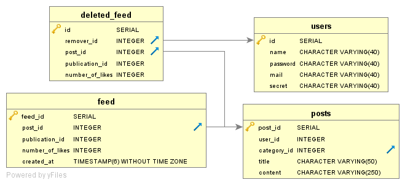
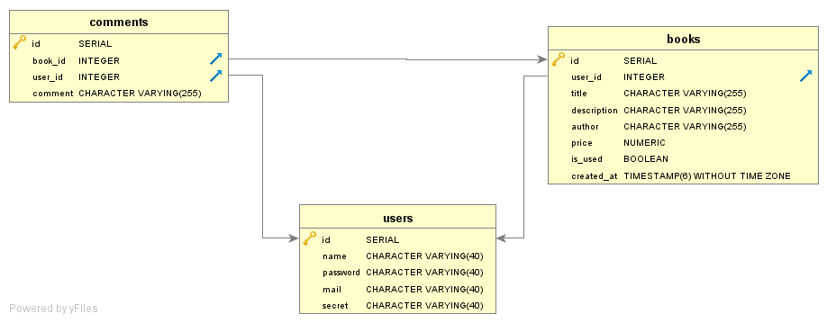
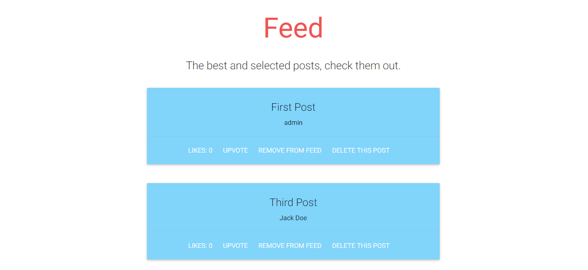
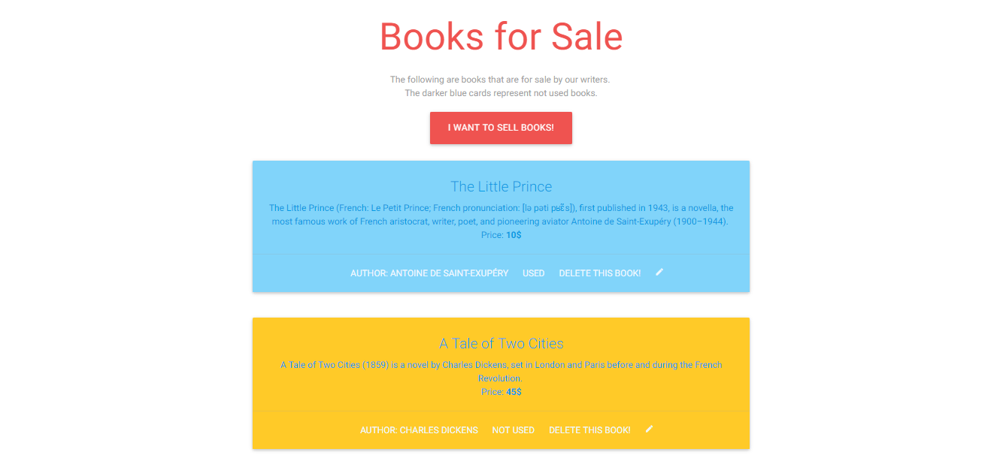
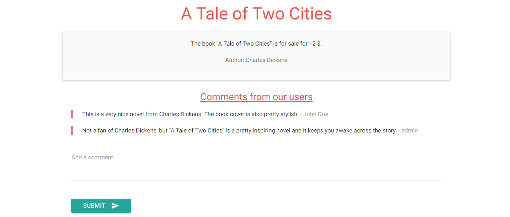

Parts Implemented by Burak Karakan
================================

Blueprints
----------

In order to achieve seperate workflows for each of the developers and minimize the VCS conflict problems, there was a need for different files for different developers. In Python, this is achieved using `Blueprint`s. The blueprints are implemented by Burak Karakan for each of the developers by creating different `.py` files and registering them to the app with the following code:

.. code-block:: python

      from Feed import feed
      from Products import product
      from Profile import profile
      from Publication import publication
      from Auth import auth
      from Home import home
      from Post import post

      # Register the blueprints for different team members, in order to minimize the conflicts.
      app = Flask(__name__)
      app.register_blueprint(home)
      app.register_blueprint(auth)
      app.register_blueprint(feed)
      app.register_blueprint(post)
      app.register_blueprint(profile)
      app.register_blueprint(publication)
      app.register_blueprint(product)
   
And in order to achieve this structure, every file uses a simple Blueprint declaration like this:

.. code-block:: python

      from flask import Blueprint
      feed = Blueprint('feed', __name__)

Database Structures
-------------------

In order to keep the `Alter` statements and table creator queries seperate, there was a need to create seperate queries for creating or dropping the foreign keys, which is implemented by Burak Karakan. The methods are implemented as follows:

In order to define the required relationships, the following `ALTER` statements are used:

.. code-block:: python

      def drop_foreign_keys():
          with dbApi.connect(app.config['dsn']) as connection:
              cursor = connection.cursor()
              query = """ALTER TABLE IF EXISTS PROFILE DROP CONSTRAINT IF EXISTS profile_job_id_fkey;"""
              cursor.execute(query)
              query = """ALTER TABLE IF EXISTS FEED DROP CONSTRAINT IF EXISTS feed_post_id_fkey;"""
              cursor.execute(query)
              query = """ALTER TABLE IF EXISTS DELETED_FEED DROP CONSTRAINT IF EXISTS deleted_feed_remover_id_fkey;"""
              cursor.execute(query)
              query = """ALTER TABLE IF EXISTS DELETED_FEED DROP CONSTRAINT IF EXISTS deleted_feed_post_id_fkey;"""
              cursor.execute(query)
              query = """ALTER TABLE IF EXISTS PUBLICATION DROP CONSTRAINT IF EXISTS publication_author_id_fkey;"""
              cursor.execute(query)
              query = """ALTER TABLE IF EXISTS POSTS DROP CONSTRAINT IF EXISTS posts_category_id_fkey;"""
              cursor.execute(query)
              query = """ALTER TABLE IF EXISTS USERSPUBS DROP CONSTRAINT IF EXISTS userpubs_user_id_fkey;"""
              cursor.execute(query)
              query = """ALTER TABLE IF EXISTS USERSPUBS DROP CONSTRAINT IF EXISTS userpubs_publication_id_fkey;"""
              cursor.execute(query)
              query = """ALTER TABLE IF EXISTS BOOKS DROP CONSTRAINT IF EXISTS products_user_id_fkey;"""
              cursor.execute(query)
              query = """ALTER TABLE IF EXISTS COMMENTS DROP CONSTRAINT IF EXISTS comments_user_id_fkey;"""
              cursor.execute(query)
              query = """ALTER TABLE IF EXISTS COMMENTS DROP CONSTRAINT IF EXISTS comments_book_id_fkey;"""
              cursor.execute(query)

              connection.commit()

      def add_foreign_keys():
          with dbApi.connect(app.config['dsn']) as connection:
              cursor = connection.cursor()
              query = """ALTER TABLE PROFILE ADD FOREIGN KEY (job_id) REFERENCES JOBS(id);"""
              cursor.execute(query)
              query = """ALTER TABLE FEED ADD FOREIGN KEY (post_id) REFERENCES POSTS(post_id) ON DELETE CASCADE;"""
              cursor.execute(query)
              query = """ALTER TABLE DELETED_FEED ADD FOREIGN KEY (post_id) REFERENCES POSTS(post_id) ON DELETE CASCADE;"""
              cursor.execute(query)
              query = """ALTER TABLE DELETED_FEED ADD FOREIGN KEY (remover_id) REFERENCES USERS(id) ON DELETE CASCADE;"""
              cursor.execute(query)
              query = """ALTER TABLE PUBLICATION ADD FOREIGN KEY (author_id) REFERENCES AUTHORS(author_id) ON DELETE CASCADE;"""
              cursor.execute(query)
              query = """ALTER TABLE POSTS ADD FOREIGN KEY (category_id) REFERENCES CATEGORIES(category_id) ON DELETE CASCADE;"""
              cursor.execute(query)
              query = """ALTER TABLE USERSPUBS ADD FOREIGN KEY (user_id) REFERENCES USERS(id) ON DELETE CASCADE;"""
              cursor.execute(query)
              query = """ALTER TABLE USERSPUBS ADD FOREIGN KEY (publication_id) REFERENCES PUBLICATION(publication_id) ON DELETE CASCADE;"""
              cursor.execute(query)
              query = """ALTER TABLE BOOKS ADD FOREIGN KEY (user_id) REFERENCES USERS(id) ON DELETE CASCADE;"""
              cursor.execute(query)
              query = """ALTER TABLE COMMENTS ADD FOREIGN KEY (user_id) REFERENCES USERS(id) ON DELETE CASCADE;"""
              cursor.execute(query)
              query = """ALTER TABLE COMMENTS ADD FOREIGN KEY (book_id) REFERENCES BOOKS(id) ON DELETE CASCADE;"""
              cursor.execute(query)

              connection.commit()

Feed
----

The Feed is actually one of the most important parts of the user experience in XLarge. The Feed is a simple entity that connects some existing posts to the feed by referencing them with their ID. Also, a user seeing the post on the Feed page can upvote it, and in order to keep the likes counter, the `feed` entity is used again. An admin can delete posts from Feed, and in order to keep track of these deleted posts, there is the `deleted_feed` entity. This entity holds the removed feed posts by the remover user ID, and is connected to the posts by the post ID. The E/R diagram of the feed structure is as follows:

   

The `feed` and `deleted_feed` entities are generated with the following SQL operations:

.. code-block:: python

      # Create the feed table with two fields, post_id and number_of_likes.
      def create_feed_table():
          with dbApi.connect(app.config['dsn']) as connection:
              cursor = connection.cursor()

              query = """DROP TABLE IF EXISTS FEED"""
              cursor.execute(query)

              query = """CREATE TABLE FEED (
                      feed_id SERIAL PRIMARY KEY,
                      post_id INTEGER,
                      publication_id INTEGER,
                      number_of_likes INTEGER,
                      created_at TIMESTAMP)"""
              cursor.execute(query)

              query = """DROP TABLE IF EXISTS DELETED_FEED"""
              cursor.execute(query)

              query = """CREATE TABLE DELETED_FEED (
                      id SERIAL PRIMARY KEY,
                      remover_id INTEGER,
                      post_id INTEGER,
                      publication_id INTEGER,
                      number_of_likes INTEGER)"""
              cursor.execute(query)

              connection.commit()
              return True

The `Feed` is generated with the following Python code that is mixed with an SQL query:

.. code-block:: python

      def get_all_feed():
          with dbApi.connect(app.config['dsn']) as connection:
              cursor = connection.cursor()

              query = """SELECT FEED.post_id, title, name, number_of_likes FROM FEED
              JOIN POSTS ON FEED.post_id = POSTS.post_id
              JOIN USERS ON POSTS.user_id = USERS.id
              ORDER BY feed_id"""
              cursor.execute(query)
              connection.commit()
              return cursor

After calling this method, the `cursor` object is iterated over and the `Feed` UI is generated with this method.

In order to insert into the feed a new post by checking the checkboxes, the following structure is used.

.. code-block:: python

      @feed.route("/add-posts-to-feed", methods=['GET', 'POST'])
      @login_required
      def list_all_the_posts():
          if request.method == "GET":
              posts = get_all_posts()

              return render_template("feed/list_all_posts.html", posts=posts)
          else:
              id_list = request.form.getlist('selected_posts')

              if id_list:
                  insert_into_feed(id_list)
              return redirect('/feed')

      def insert_into_feed(id_list):
          with dbApi.connect(app.config['dsn']) as connection:
              now = datetime.now()
              query = "INSERT INTO FEED (post_id, publication_id, number_of_likes, created_at) VALUES "
              for id in id_list:
                  query += "(" + id + ", 0, 0, '" + now.strftime('%Y-%m-%d %H:%M:%S') + "'),"

              query = query[:-1]
              cursor = connection.cursor()
              cursor.execute(query)
              connection.commit()
              return True

Feed posts also have the ability to upvote, which is a simple `UPDATE` query, which is as follows:

.. code-block:: python

      def upvote_feed_post(post_id, likes):
          with dbApi.connect(app.config['dsn']) as connection:
              likes = int(likes) + 1
              cursor = connection.cursor()

              query = """UPDATE FEED
              SET number_of_likes=%s
              WHERE post_id = %s;""" % (likes, post_id)
              cursor.execute(query)
              connection.commit()

              return True

The Feed posts could be removed by the admins, and a removed post would be inserted into the `deleted_feed` entity, the code implementing this behaviour is structured as follows:

.. code-block:: python

      @feed.route("/delete-from-feed/<post_id>")
      @login_required
      def delete_post_feed(post_id):
          delete_feed_post(post_id)
          return redirect('/feed')

      def delete_feed_post(id):
          with dbApi.connect(app.config['dsn']) as connection:
              cursor = connection.cursor()

              query = "SELECT post_id, publication_id, number_of_likes FROM FEED WHERE post_id=%s" % id
              cursor.execute(query)
              insert_into_deleted_feed(cursor.fetchone())

              query = """DELETE FROM FEED
              WHERE post_id = %s;""" % id
              cursor.execute(query)
              connection.commit()

              return True

      def insert_into_deleted_feed(post):
          with dbApi.connect(app.config['dsn']) as connection:
              now = datetime.now()
              query = """INSERT INTO DELETED_FEED (remover_id, post_id, publication_id, number_of_likes) VALUES
                    (%d, %d, %d, %d)""" % (int(current_user.id), int(post[0]), int(post[1]), int(post[2]))
              cursor = connection.cursor()
              cursor.execute(query)
              connection.commit()
              return True

Books for Sale
--------------

In the "*Books for Sale*" part, we tried to create an engaging feature for **XLarge**. At first, there was a need for a `books` entity, which all the books would remain in. After implementing the book displaying, adding, updating and removing features, next thing to build was the ability for users to comment on books. The book details are moved to a new page, which has a comment box at the bottom of the page. The comments are stored in an entity named as `comments`, which is connected to the `users` entity in order to track who posted the comment. The E/R diagram of the `Books for Sale` feature is as follows:

   

Adding, updating and removing a book is simply implemented by using the following Python methods with the help of SQL queries:

.. code-block:: python

      def get_book_with_id(id):
          with dbApi.connect(app.config['dsn']) as connection:
              cursor = connection.cursor()

              query = """SELECT title, description, author, price,
              is_used
              from BOOKS where id=%s""" % id
              cursor.execute(query)
              connection.commit()
              return cursor

      def delete_book(id):
          with dbApi.connect(app.config['dsn']) as connection:
              cursor = connection.cursor()

              query = """DELETE FROM BOOKS
              WHERE id = %s;""" % id
              cursor.execute(query)
              connection.commit()

              return True

      def update_book(id, title, description, author, price, is_used):
          with dbApi.connect(app.config['dsn']) as connection:
              cursor = connection.cursor()
              if is_used == "on":
                  is_used = True
              else:
                  is_used = False

              cursor.execute("""UPDATE BOOKS SET
              title=%s,
              description=%s,
              author=%s,
              price=%s,
              is_used=%s
              WHERE id = %s;""", (title, description, author, price, is_used, id))
              connection.commit()

              return True

      def create_new_book_ad(title, description, author, price, is_used):
          with dbApi.connect(app.config['dsn']) as connection:
              now = datetime.now()
              if is_used == "on":
                  is_used = True
              else:
                  is_used = False

              cursor = connection.cursor()
              cursor.execute("""INSERT INTO BOOKS (user_id, title, description, author, price, is_used, created_at)
                              VALUES (%s, %s, %s, %s, %s, %s, %s);""", (
                              current_user.id, title, description, author, price, is_used, now.strftime('%Y-%m-%d %H:%M:%S')))
              connection.commit()
              return True

Since all the comments are displayed in the book details page, the admin can delete or edit a comment. If the viewer is the admin, two links appear on the corner of every card, `Edit` and `Delete` respectively. The `Edit` option allows the admin to edit the post by creating a textbox on the bottom of the comment, which is implemented in server side as follows:

.. code-block:: python

      def edit_comment(comment_id, new_comment):
          with dbApi.connect(app.config['dsn']) as connection:
              cursor = connection.cursor()

              cursor.execute("""UPDATE COMMENTS SET comment = %s WHERE id = %s""", (new_comment, comment_id))
              connection.commit()
              return True

And a `Delete` operation will execute the following method:

.. code-block:: python

      def remove_comment(comment_id):
          with dbApi.connect(app.config['dsn']) as connection:
              cursor = connection.cursor()

              query = """DELETE FROM COMMENTS WHERE id=%s""" % comment_id
              cursor.execute(query)
              connection.commit()
              return True

   
   
UI Improvements
---------------

There was the requirement for a layout structure to be built. The layout is built by Burak Karakan using the CSS framework Materialize [1]. The framework is based on the Google's Material Design guides, it is responsive and easy-to-use, has a grid and well-defined helper classes. The Material Design guides are pretty clear in user interface decisions, and using a framework allows to keep system UI consistent across different pages and functionalities. Also, in order to create a smooth experience in the pages, jQuery, one of the most popular JavaScript libraries, is included and used across the system.

XLarge UI is inspired by simplicity. Therefore, the simplistic usages of effects and styling are adopted. In the `Feed` page, simple cards to show posts are used in order to keep the interface minimalistic. 

   
   
In the book selling, the listing page is pretty similar to the `Feed` page, just by the nuance that the card colors differ from each other by the status of the book, used or not used.

   
The Book displaying page has the book information on top, while the comments are listed below the book card, which looks like as follows:

   
The textbox below is useful for adding comments easily without routing to another page, which has a simple JS character counter that counts the number of characters in the textbox. Also the admins have the ability to edit the posts with a textbox appearing below the comment. The textbox is loaded with the initial view and displayed with the following JavaScript:

.. code-block:: javascript

      $('.edit-comment').click(function (e) {
           e.preventDefault();
           
           // Get the form ID.
           var formName = $(this).data("form-id");
           
           // Fill the textbox with the comment value.
           $('#edit-form' + formName).val(
               $(this).closest('blockquote').children('span').text()
           );
           
           // Update the Materialize textbox.
           Materialize.updateTextFields();
           
           // Display the textbox.
           $('#form-row' + formName).show();
       });
       
With the help of jQuery and Materialize, the textbox is displayed to the admin.

[1]: http://materializecss.com
