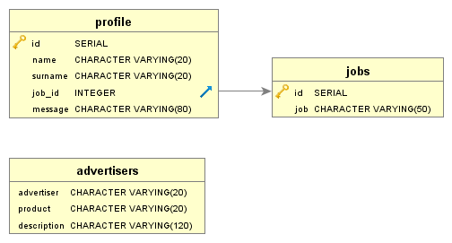
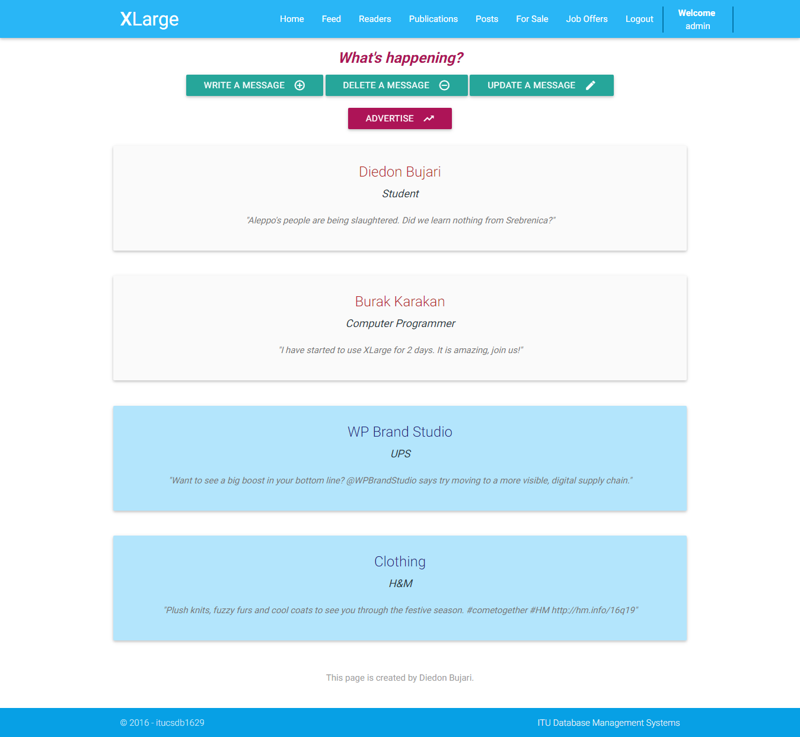
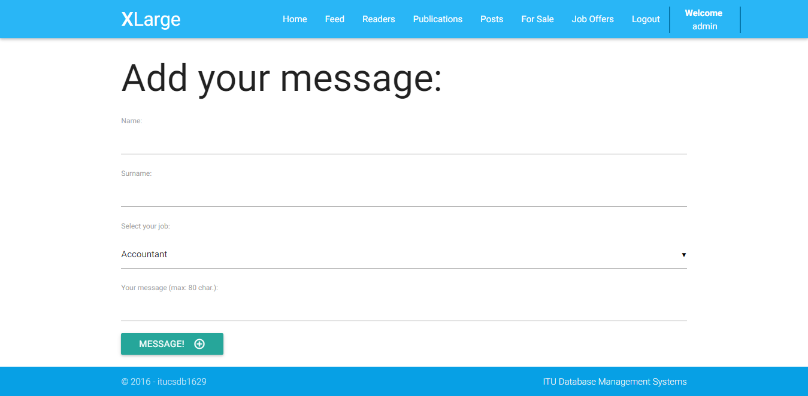
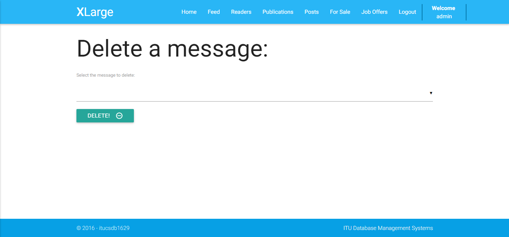
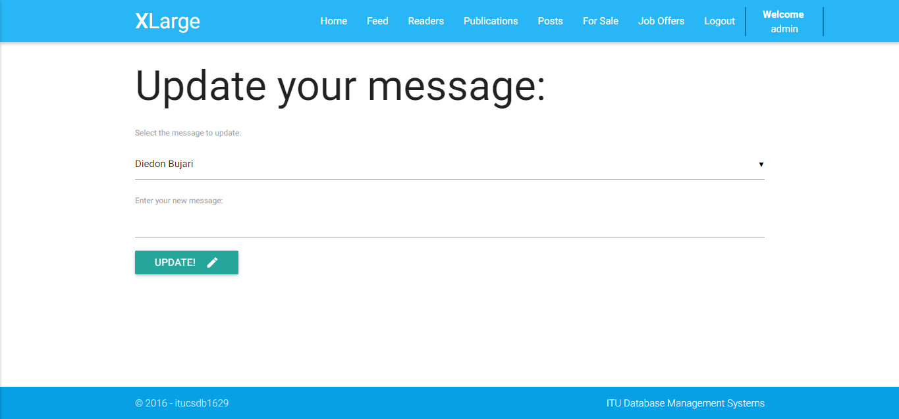
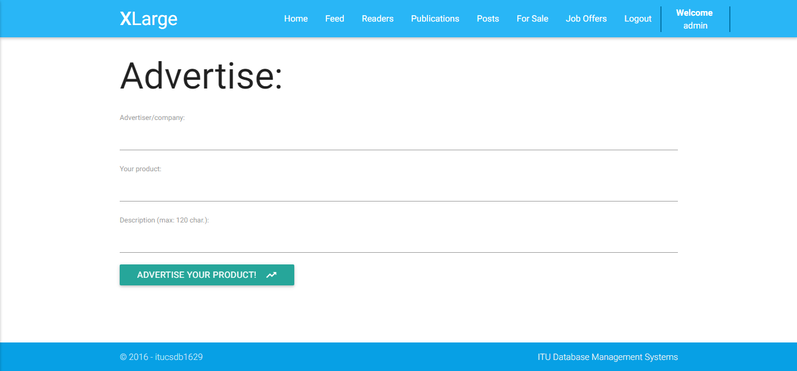

Parts Implemented by Diedon Bujari
==================================

Readers
-------
Although the **"Readers"** is not dependent to any of the other functionalities, it is a very important feature, which enthuses and intents others to open accounts for using the main functionalities of the page.

It has a simple structure, containing three entities. Its structure can be shown using the E/R diagram shown below:

These entities are generated with the following SQL operations:

.. code-block:: python

          # Create the profile and jobs tables.
          def create_profile_table():
              with dbApi.connect(app.config['dsn']) as connection:
                  cursor = connection.cursor()

                  query = """DROP TABLE IF EXISTS JOBS"""
                  cursor.execute(query)
                  query = """CREATE TABLE JOBS (id SERIAL PRIMARY KEY,job VARCHAR(50))"""
                  cursor.execute(query)

                  query = """DROP TABLE IF EXISTS PROFILE"""
                  cursor.execute(query)
                  query = """CREATE TABLE PROFILE (
                          id SERIAL PRIMARY KEY,
                          name VARCHAR(20),
                          surname VARCHAR(20),
                          job_id INTEGER,
                          message VARCHAR(80)
                  )"""
                  cursor.execute(query)

                  query = """DROP TABLE IF EXISTS ADVERTISERS"""
                  cursor.execute(query)
                  query = """CREATE TABLE ADVERTISERS (
                          advertiser VARCHAR(20),
                          product VARCHAR(20),
                          description VARCHAR(120)
                  )"""
                  cursor.execute(query)
                  connection.commit()

                  return True

The main entity here is the **'profile'** table. The profile of the reader has these attributes: 

- the *id* of the reader, which has a serial type - it means that it increases automatically, as new profiles write to the page. It is the primary key of this entity.
- the *name* of the reader, which has a varying character type - with maximum 20 characters, but can also be shorter
- the *surname* of the reader, which has a varying character type - with maximum 20 characters, but can also be shorter
- the *job_id*, which has an integer type. It is a foreign key used to connect to the *jobs* entity, to define the profession of the reader, and
- the *message* of the reader, which has a varying character type - with maximum 80 characters, but can also be shorter.

As you can understand from these definitions, the table keeps the name and surname of the reader, his/her profession and the message written by him/her.

The **'jobs'** entity has just two attributes:

- the *id* of the job, which has a serial type
- the *job*'s name, which has a varying character type of maximum 50 characters

This table is filled with some default values when the database is initialized. This is done with the following SQL operations:

.. code-block:: python

          # Seed the jobs table.
          def seed_jobs_table():
              with dbApi.connect(app.config['dsn']) as connection:
                  cursor = connection.cursor()

                  query = """INSERT INTO
                          JOBS (id, job)
                          VALUES
                              (1, 'Accountant'),
                              (2, 'Architect'),
                              (3, 'Chef'),
                              (4, 'Computer Programmer'),
                              (5, 'Director'),
                              (6, 'Engineer'),
                              (7, 'Lawyer'),
                              (8, 'Student'),
                              (9, 'Teacher'),
                              (10, 'Teacher Assistant')"""
                  cursor.execute(query)
                  connection.commit()

                  return True

The **'advertiser'** table is completely independent. Its attributes are as follows:

- the *advertiser*'s information (name and surname, or the name of the company), which has a varying character type of maximum 20 characters
- the *product*'s information, which has a varying character type of maximum 20 characters, and
- the *description* of the product, which has a varying character type of maximum 120 characters.

Main functionalities:
---------------------
In the main page of the *Readers* tab, you can see all the messages written and also the advertisements. This is implemented using this part of code:

.. code-block:: python

          @profile.route("/profile")
          def main():
              profile = list_profiles()
              advertisement = get_all_advertisements()
              return render_template('profile/profile.html', profile=profile, advertisement=advertisement)

The *list_profiles()* function returns information about the message writter (name, surname, profession and message). This is generated with the following Python code that is mixed with an SQL query:

.. code-block:: python

          def list_profiles():
              with dbApi.connect(app.config['dsn']) as connection:
                  cursor = connection.cursor()

                  query = """SELECT PROFILE.name, surname, JOBS.job, message FROM
                  PROFILE join JOBS on PROFILE.job_id=JOBS.id;"""
                  cursor.execute(query)
                  connection.commit()

                  return cursor

The *get_all_advertisements()* function returns information about the ad (advertiser, product and description). This is generated with the following Python code that is mixed with an SQL query:

.. code-block:: python

          def get_all_advertisements():
              with dbApi.connect(app.config['dsn']) as connection:
                  cursor = connection.cursor()

                  query = """SELECT advertiser, product, description FROM ADVERTISERS;"""
                  cursor.execute(query)
                  connection.commit()

                  return cursor

In order to add a message, the following structure is used:

.. code-block:: python

          @profile.route("/add_profile", methods=['GET', 'POST'])
          def add_profile():
              if request.method == 'POST':
                  profile_name = request.form.get('first_name')
                  profile_surname = request.form.get('surname')
                  profile_job = request.form.get('job_id')
                  profile_message = request.form.get('mess')
                  insert_profile(profile_name, profile_surname, profile_job, profile_message)
                  return redirect('/profile')
              else:
                  jobs = get_all_jobs()
                  return render_template('profile/add_profile.html', jobs=jobs)

          def insert_profile(firstname_, surname_, job_id, message):
              with dbApi.connect(app.config['dsn']) as connection:
                  cursor = connection.cursor()

                  cursor.execute("""INSERT INTO PROFILE(name, surname, job_id, message)
                  VALUES(%s, %s, %s,%s)
                          """, (firstname_, surname_, job_id, message))

                  connection.commit()

                  return True

The *get_all_jobs()* function is used to show all the jobs in the dropdown menu, while adding a message. The function is as follows:

.. code-block:: python

          def get_all_jobs():
              with dbApi.connect(app.config['dsn']) as connection:
                  cursor = connection.cursor()

                  query = """SELECT id, job FROM JOBS;"""
                  cursor.execute(query)
                  connection.commit()

                  return cursor

The messages can be deleted by authenticated users. In order to achieve this, I have written the following code:

.. code-block:: python

          @profile.route('/delete_profile', methods=['GET', 'POST'])
          @login_required
          def delete_profile():
              if request.method == 'POST':
                  profile_id = request.form.get('profile_id')
                  remove_profile(profile_id)
                  return redirect("/profile")
              else:
                  profiles = get_all_profiles()
                  return render_template('profile/delete_profile.html', profiles=profiles)

          def get_all_profiles():
              with dbApi.connect(app.config['dsn']) as connection:
                  cursor = connection.cursor()

                  query = """SELECT id, name, surname FROM PROFILE;"""
                  cursor.execute(query)
                  connection.commit()

                  return cursor

          def remove_profile(firstname_):
              with dbApi.connect(app.config['dsn']) as connection:
                  cursor = connection.cursor()

                  cursor.execute("""DELETE FROM PROFILE
                  where id = %s""", (firstname_,))
                  connection.commit()

                  return True

The *get_all_profiles()* function shows the name and the surname of the reader in the dropdown menu, and the user selects among them the message to be deleted. The *remove_profile* function removes that message from the database.

When someone decides to update a message, he/she should press the update button in the home page, select the name and surname of the message's writer from the dropdown menu, and write the new message. This functionality is achieved using the following Python code, mixed with some SQL queries:

.. code-block:: python

          @profile.route("/update_profile", methods=['GET', 'POST'])
          def update_profile():
              if request.method == 'POST':
                  profile_id = request.form.get('profile_id')
                  new_mess = request.form.get('new_mess')
                  up_todate_profile(profile_id, new_mess)
                  return redirect('/profile')
              else:
                  profiles = get_all_profiles()
                  if profiles.rowcount == 0:
                      return redirect("/profile")
                  else:
                      return render_template('profile/update_profile.html', profiles=profiles)

          def up_todate_profile(profileid_, newmess_):
              with dbApi.connect(app.config['dsn']) as connection:
                  cursor = connection.cursor()

                  cursor.execute("""UPDATE PROFILE SET message = %s
                          where id = %s""", (newmess_, profileid_))
                  connection.commit()

                  return True

If you press the advertise button in the home page, you are directed to the page where you have a form. The form asks you to enter your information and the information about the product you want to publicize. Advertising is implemented using the following code:

.. code-block:: python

          @profile.route("/advertise", methods=['GET', 'POST'])
          def advertise():
              if request.method == 'POST':
                  advert_name = request.form.get('advertiser_name')
                  advert_product = request.form.get('product')
                  advert_description = request.form.get('description')
                  insert_advert(advert_name, advert_product, advert_description)
                  return redirect('/profile')
              return render_template('profile/advertise.html')

          def insert_advert(advertname_, advertproduct_, advertdescription_):
              with dbApi.connect(app.config['dsn']) as connection:
                  cursor = connection.cursor()

                  cursor.execute("""INSERT INTO ADVERTISERS(advertiser, product, description)
                  VALUES(%s, %s, %s)
                          """, (advertname_, advertproduct_, advertdescription_))
                  connection.commit()

                  return True

The User Interface:
-------------------
The layout of the *Readers* tab is simple, but expresses sympathy:

There are four buttons, which redirect you to the related pages: Write a message, Delete a message, Update a message and Advertise. 

If you click the *Write a message* button, you will be redirected to the form where the reader should fill the required information, and when finished, click the *Message* button to share the message.

If you click the *Delete a message* button, you will be redirected to the login page, where you should give your account email and password. If you are an authenticated user of our platform, you can delete a message by selecting the name and the surname of the writer from the dropdown menu and then, click the *Delete* button.

If you click the *Update a message* button, you will be redirected to the the form where the reader should select the name and the surname of the writer from the dropdown menu, and update his/her message by writing a new one. At the end, just click the *Update* button.

If you click the *Advertise* button, you will be redirected to the form where the advertiser fills his/her/company's information and gives some description about the product being advertised. At the end, just click the *Advertise your product* button.

