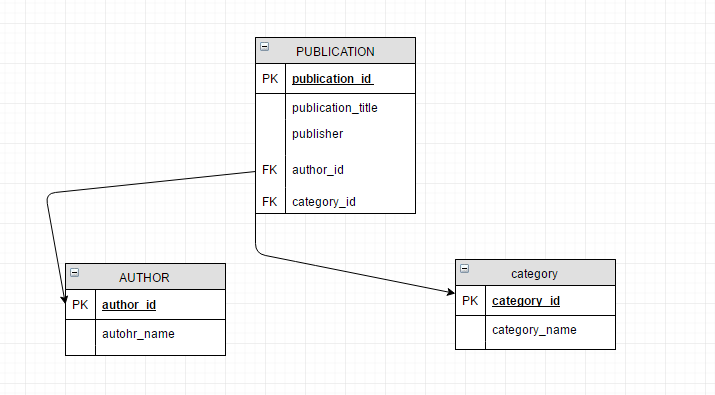
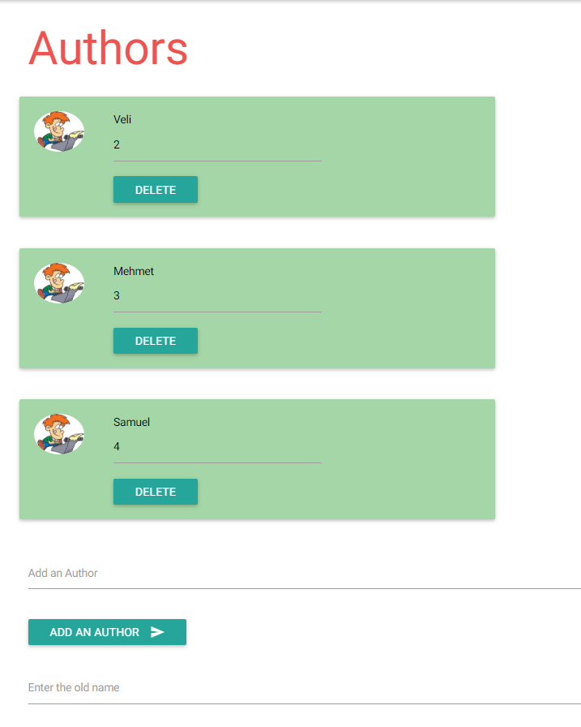
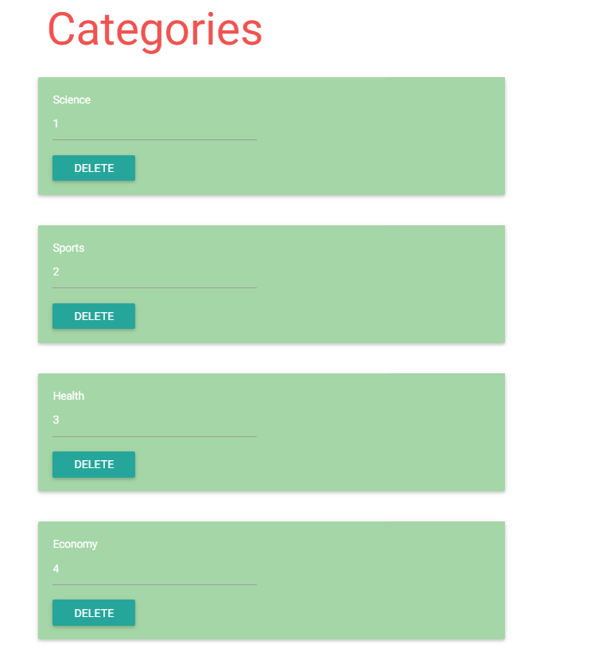
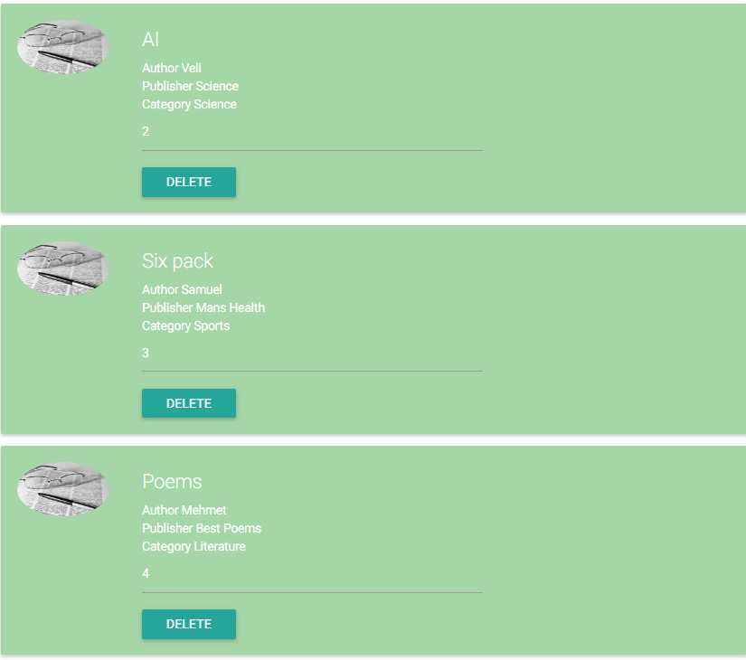

Parts Implemented by Uğur Uysal
==============================

Publication table, author table and category table are crated by Ugur Uysal 
-----------------------------------------------------------------------

.. code-block:: python

  def create_pubcategory_table():
       with dbApi.connect(app.config['dsn']) as connection:
       cursor = connection.cursor()

       query = """DROP TABLE IF EXISTS category"""
       cursor.execute(query)
       query = """CREATE TABLE category (
                category_id SERIAL PRIMARY KEY,
                category_name VARCHAR(20) UNIQUE)"""
       try:
            cursor.execute(query)
       except:
            return False;
       connection.commit()

  return True

 def seed_pubcategory_table():
       with dbApi.connect(app.config['dsn']) as connection:
       cursor = connection.cursor()

       query = """INSERT INTO
                category (category_name)
                VALUES
                    ('Science'),
                    ('Sports'),
                    ('Health'),
                    ('Economy'),
                    ('Technology'),
                    ('Literature')"""
       try:
            cursor.execute(query)
       except:
            return False
       connection.commit()

 return True
    
 def create_publication_table():
        with dbApi.connect(app.config['dsn']) as connection:
        cursor = connection.cursor()

        query = """DROP TABLE IF EXISTS PUBLICATION CASCADE"""
        cursor.execute(query)
        query = """CREATE TABLE PUBLICATION (
                publication_id SERIAL PRIMARY KEY,
                publication_title VARCHAR(40),
                publisher VARCHAR(20),
                author_id INTEGER,
                category_id INTEGER)"""

        try:
            cursor.execute(query)
        except:
            return False;
        connection.commit()

        return True
        
 def seed_publication_table():
        with dbApi.connect(app.config['dsn']) as connection:
        cursor = connection.cursor()

        query = """INSERT INTO
                PUBLICATION (publication_title, publisher, author_id, category_id)
                VALUES
                    ('IoT', 'IEEE Spectrum',1,5),
                    ('AI','Science',2,1),
                    ('Six pack','Mans Health',4,2),
                    ('Poems', 'Best Poems', 3, 6),
                    ('Cancer', 'Your Life', 4, 3)"""
        try:
            cursor.execute(query)
        except:
            return False
        connection.commit()

        return True
        

Reference with F_key operation are done with these queries 
----------------------------------------------------------

.. code-block:: python

       query = """ALTER TABLE PUBLICATION ADD FOREIGN KEY (category_id) 
        REFERENCES category(category_id) ON DELETE CASCADE;"""
       query = """ALTER TABLE PUBLICATION ADD FOREIGN KEY (author_id) 
        REFERENCES AUTHORS(author_id) ON DELETE CASCADE;"""
      

All CRUD operations are implemented in Publication.py and Cat_aut.py files.
--------------------------------------------------------------------------

.. code-block:: python

 @publication.route("/publications")
 @login_required
 def main():
   pubs=get_all_publications()
   return render_template('publication/publications.html',pubs = pubs)
  
 @publication.route("/publications/add", methods=['POST'])
 @login_required
 def new_publication_form():
    authors  = request.form['author']
    title = request.form['title']
    publisher = request.form['publisher']
    category = request.form['category']
    connection = dbApi.connect(app.config['dsn'])
    with connection.cursor() as cur:
        query = """SELECT author_id FROM AUTHORS 
                    WHERE author_name = %s"""
        cur.execute(query,(authors,))
        try:
            author_id = cur.fetchone()[0]
        except:
            insert_to_authors(authors)
    connection.close()
    
    connection3 = dbApi.connect(app.config['dsn'])
    with connection3.cursor() as cur:
        query = """SELECT category_id FROM category 
                    WHERE category_name = %s"""
        cur.execute(query,(category,))
        try:
            category_id = cur.fetchone()[0]
        except:
            insert_category(category)
    connection3.close()
    
    connection2 = dbApi.connect(app.config['dsn'])
    with connection2.cursor() as cur:
        query = """SELECT author_id FROM AUTHORS 
                    WHERE author_name = %s"""
        cur.execute(query,(authors,)) 
        author_id = cur.fetchone()[0]
        query = """SELECT category_id FROM category 
                    WHERE category_name = %s"""
        cur.execute(query,(category,)) 
        category_id = cur.fetchone()[0]
        query = """INSERT INTO
                PUBLICATION (publication_title, publisher, author_id, category_id)
                VALUES
                    (%s, %s, %s, %s)"""
        cur.execute(query,(title, publisher,author_id,category_id))  
    connection2.commit()
    connection2.close()
   
    return redirect("/publications")

 @login_required
 def insert_to_authors(author_name):
    with dbApi.connect(app.config['dsn']) as connection:
        cursor = connection.cursor()
        query = """INSERT INTO AUTHORS (author_name) VALUES
        (%s)"""
        cursor.execute(query,(author_name,))
        connection.commit()    
    return

 @publication.route("/publications/delete" , methods=['POST'] )
 @login_required
 def delete_from_publication():
   publication_id = request.form['publication_id']
   connection = dbApi.connect(app.config['dsn'])
   with connection:        
        query = """DELETE FROM PUBLICATION 
                    WHERE publication_id = %s"""
        with connection.cursor() as cur:
            cur.execute(query,(publication_id,))
        
   connection.close()
   
   return redirect("/publications")

 @publication.route("/publications/select" , methods=['POST'] )
 @login_required
 def select_from_publication():
   aut_name = request.form['aut_name'] 
   with dbApi.connect(app.config['dsn']) as connection:
        cursor = connection.cursor()

        query = """SELECT COUNT(publication_id) FROM PUBLICATION,AUTHORS
                    WHERE  author_name= %s AND 
                    PUBLICATION.author_id = AUTHORS.author_id"""

        cursor.execute(query,(aut_name,))
        connection.commit()
        x = cursor.fetchone()[0]
        return str(x)

 @publication.route("/publications/update" , methods=['POST'] )
 @login_required
 def update_publication():
   up_name = request.form['up_name']
   up_tit = request.form['up_tit']
   with dbApi.connect(app.config['dsn']) as connection:
        cursor = connection.cursor()

        query = """UPDATE PUBLICATION SET publication_title = %s 
                    WHERE publication_title =%s;"""

        cursor.execute(query,(up_tit,up_name))
        connection.commit()
   return redirect("/publications")

 @login_required
 def get_all_publications():
   with dbApi.connect(app.config['dsn']) as connection:
       cursor = connection.cursor()
       query = """SELECT publication_id, publication_title, publisher, author_name, 
          category_name FROM PUBLICATION,AUTHORS,category
                            WHERE PUBLICATION.author_id = AUTHORS.author_id 
                            AND PUBLICATION.category_id = category.category_id """
       cursor.execute(query)
       connection.commit()
       return cursor
   

 @publication.route("/create-publication-table")
 @login_required
 def create_table():
    var = create_publication_table()
    if var:
        return redirect('/publications')
    else:
        return "Mission Failed: CREATE PUBLICATION TABLE"

 @publication.route("/seed-publication-table")
 @login_required
 def seed_table():
    var = seed_publication_table()
    if var:
        return redirect('/publications')
    else: 
        return "Mission Failed: SEED PUBLICATION TABLE"

 @publication.route("/test-publication-table")
 @login_required
 def test_table():
    count  = test_publication_table() 
    return "Number of records in the Publication table: %d." % count
   
 
 @publication.route("/create-and-seed-publication-table")
 @login_required
 def create_and_seed():
    create_publication_table()
    seed_publication_table()
    return redirect('/publications')

 @login_required
 def insert_category(category_name):
    with dbApi.connect(app.config['dsn']) as connection:
        cursor = connection.cursor()
        query = """INSERT INTO category (category_name)
        VALUES (%s) """
        cursor.execute(query,(category_name,))
        connection.commit()
    return
Above, publication tables CRUD operations are listed, when admin try to insert new publication if publication author or publication category are not available in their own tables, it insert author or categort or both into their tables.   

Category and author operation are here

.. code-block:: python

 @cat_aut.route("/cat-aut")
 @login_required
 def main():
   cat = get_all_cat()
   authors = get_all_authors()
   return render_template('publication/cat_and_authors.html', 
   cat =cat, authors=authors)

 @cat_aut.route("/cat-aut/cat-add",  methods= ['POST'])
 @login_required
 def add_category():
    category_name = request.form['cat_name']
    with dbApi.connect(app.config['dsn']) as connection:
        cursor = connection.cursor()
        query = """INSERT INTO category (category_name)
        VALUES (%s) """
        cursor.execute(query,(category_name,))
        connection.commit()
        
    return redirect("/cat-aut")

 @cat_aut.route("/cat-aut/cat-del",  methods= ['POST'])
 @login_required
 def del_category():
    category_id = request.form['category_id']
    with dbApi.connect(app.config['dsn']) as connection:
        cursor = connection.cursor()
        query = """DELETE FROM category WHERE category_id = %s  """
        cursor.execute(query,(category_id,))
        connection.commit()
        
    return redirect("/cat-aut")

 @login_required
 def get_all_cat():
      with dbApi.connect(app.config['dsn']) as connection:
       cursor = connection.cursor()
       query = """SELECT * FROM category"""
       cursor.execute(query)
       connection.commit()
       return cursor

 @login_required
 def get_all_authors():
      with dbApi.connect(app.config['dsn']) as connection:
       cursor = connection.cursor()
       query = """SELECT * FROM AUTHORS"""
       cursor.execute(query)
       connection.commit()
       return cursor

 @cat_aut.route('/cat-aut/author-delete', methods=['POST'])
 @login_required
 def delete_from_authors():
    aut_id = request.form['author_id']
    with dbApi.connect(app.config['dsn']) as connection:
        cursor = connection.cursor()
        query = """DELETE FROM AUTHORS WHERE author_id = %s"""

        cursor.execute(query,(aut_id,))
        connection.commit()
    return redirect("/cat-aut")

 @cat_aut.route('/cat-aut/author-add', methods=['POST'])
 @login_required
 def add_author():
    aut_name = request.form['aut_name']
    with dbApi.connect(app.config['dsn']) as connection:
        cursor = connection.cursor()
        query = """INSERT INTO AUTHORS (author_name)
        VALUES (%s) """
        cursor.execute(query,(aut_name,))
        connection.commit()
    return redirect("/cat-aut")

Delete, update and add operations are only availeble for admins.

E/R diagram of tables
-------------------

Authors Admin panel
-----------------

   
Categories Admin Panel
----------------------

   
Publications Admin Panel
----------------------

