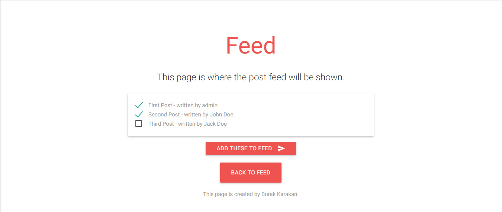
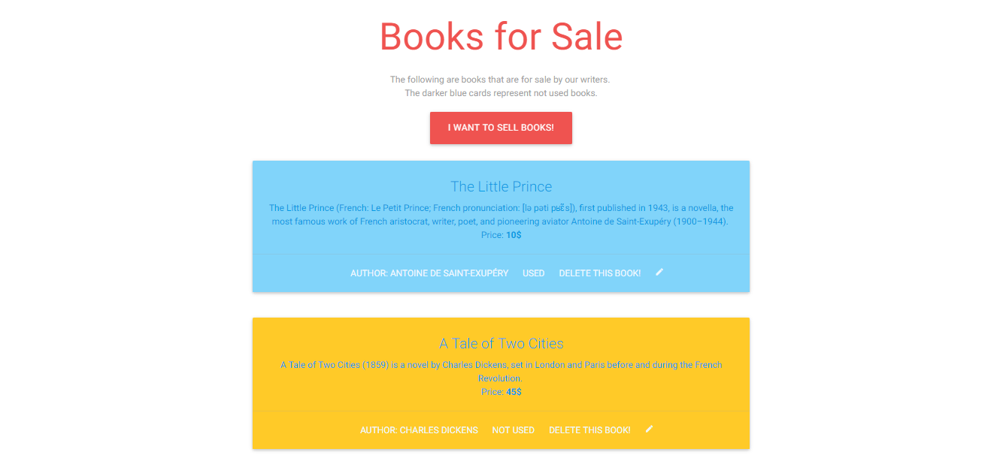
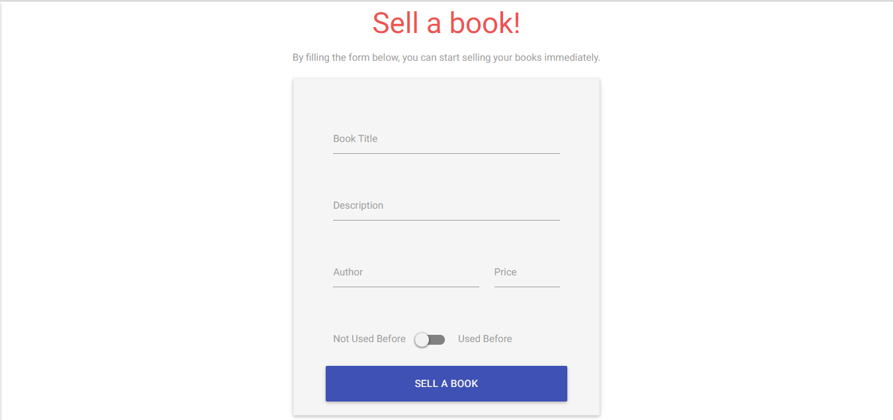
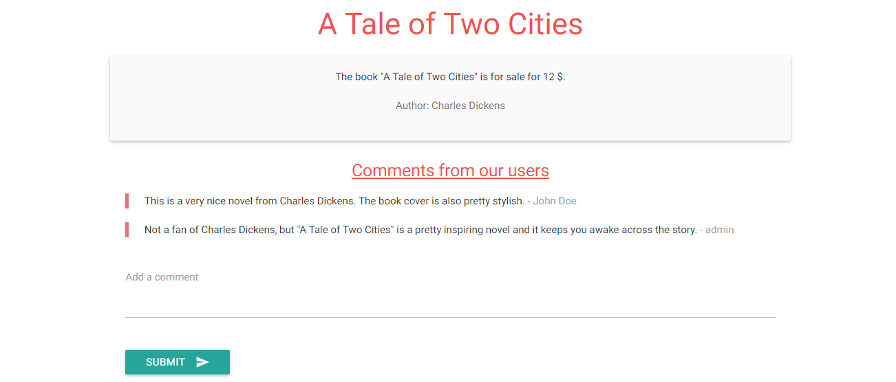
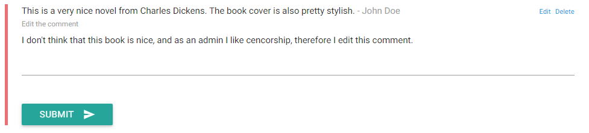

Parts Implemented by Burak Karakan
================================

Layout & Top Bar
----------------

The layout has been created by Burak Karakan in order to maintain the same experience across the whole system. It has a simple to use navigation with a one-line information footer below. Wherever you want to head over, just click the link and **TA DAA!** - you are over there.

Feed
----

The *Feed* page is the heart of the user experience of **XLarge**. The feed looks as follows:

.. figure:: images/burak/2.png
   :scale: 50 %
   :alt: Feed screenshot

You can simply update the feed page by clicking the button "Update Feed List" at the bottom of the page, which takes you to the update page. The update page fetches the existing posts of *XLarge* which are not already in the feed, and allows you to select the ones to add into the feed. You can add new posts to the feed by just checking the box next to the name of the post name. An example selection is as follows:

   
By simply checking the boxes, and clicking the button "Add these to feed", the feed will be updated and when you go back to the feed page, you will see the updated version of the feed. After these operations, you can check the new feed and upvote any post. 
   
Also, if you are an admin and you did not like a post in the feed, you can simply click the link below every post card which is called "Remove From Feed" to remove a post from the feed. After this operation, the post will be removed from the feed and sent to the *deleted feed* section. *Deleted feed* part holds the information about a removed post, such as the post statistics and the admin who removed the post from the feed. Also, since you are an admin, you can also remove a post completely from the table by clicking the link below the card called "Delete this post". This option is also available for admins in the *deleted feed* section, and its functionality is to delete a post not only from the feed, but also from the system completely. If an admin chooses to click this button, the post gets completely removed from XLarge.
   
Books For Sale
--------------

The second part implemented by *Burak Karakan* is the book selling part of the **XLarge** platform. We thought that in order to create an engaged user base, we need to allow users to **get in touch with each other** by selling books they already have in hand. XLarge acts as an *online publishing platform for its users*, and the users are already interested in reading things, which makes the experience *far more valuable* when it comes to exchanging or selling books. 

The *Books For Sale* section is easily accessible from the top navigation bar under the name of "For Sale". When you go to the link, the following page will welcome you:
   

   
The interface allows you to identify new and second hand books by giving the book cards seperate colors; blue for used and orange for not used. This way, we allow you to give a quick glance at the books and target some of them without spending too much time. The interface is pretty simple, you can see the prices and authors of the books, you can see if they are used just by the card colors with a little description of the book.
   
By just clicking "I want to sell books!", you can start selling books immediately. After clicking, you will be welcomed by the following page, where you can start selling your books immediately.
   

   
   
When you fill the form, your book will be available immediately for all of our users. Also if you are an admin, you can delete or edit a book whenever you want. Therefore, with **XLarge - Books for Sale**, you can buy the books you want with appropriate pricing.

Also, if you are have a collaborative personality, you can add comments about the books you know, and inform the other people that are considering to buy the book you already know something about. In order to share your comment, just fill the box below the comments and bam - you are done!

   
   
If you are an admin and want to edit a comment, you can just click the links that are only visible to you, called `Edit` and `Delete`, where you can edit the comment right in the place without visiting another file! Just click on the link, change the values in the following text file, and that's it!

   
   
Hope you enjoy using XLarge as your personal newspaper, where you are the content and you are the author at the same time!

