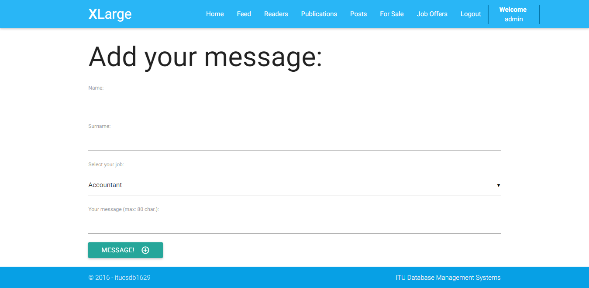
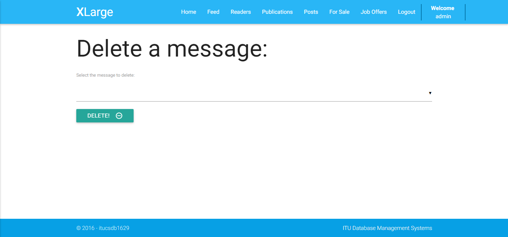
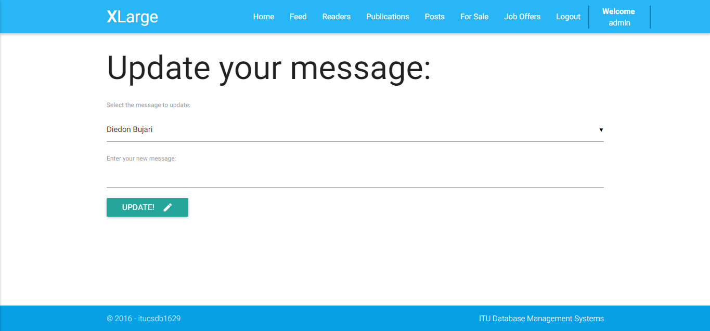
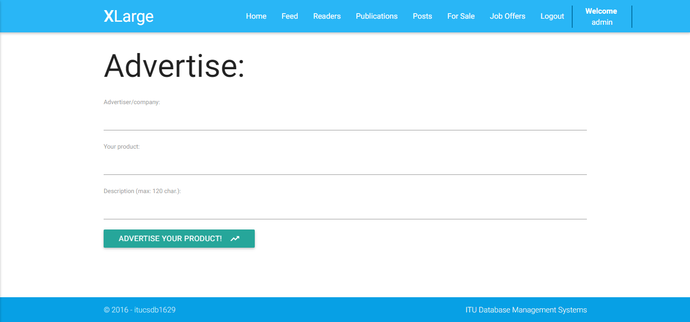

Parts Implemented by Diedon Bujari
==================================

**Readers**
-----------
The **"Readers"** tab of *XLarge* is the one which makes new users enthusiastic about using our social media platform, and intent to create their own account. And the good side of this page is that: *it does not require authentication - everyone can see it!* The page looks like this:

When entered this page, new users can see and read the messages of the others. If you are seeing the page for the first time, you can read the opinions of other users about the page and the posts, or any other message that have been made in general, and also write and read short stories.

In this page, you can also be familiar about any product which was publicized by an advertiser, a single person or a company. This will lead you make good choices in your real life when shopping or buying something.

Write a message:
----------------
If you click the *Write a message* button, you will reach this page:

If you have any interesting story, which you want to share with others, this is the platform where you can do it. Your story is restricted to be **80 characters** in maximum, but, we think that this is the reason which makes all of the stories be read. No one wants to waste time by reading a *loooooooong* story; instead, he/she chooses and is interested to have a look at a short story. **Therefore, it is guaranteed that your story will be read by every visitor or user of the page.**

Or, if you have just created a new account, and you want to enthuse and motivate others for entering *XLarge*, you can speak your mind by writing comments about the page in general or any post you have liked in our platform. **It is for sure that you will acclaim only positive opinions.** :)

The only thing you have to do is to fill the information required about yourself, as seen in the screenshot above: you should enter your *name* and *surname*, select your *job* from the dropdown menu, and write your *message*. After you enter the *Message!* button, that's it - you shared it with the others!

Delete a message:
-----------------
If you click the *Delete a message* button, you will reach this page:

However, the page is only accessible to the authenticated users of the page. The reason for this is preventing strangers delete the messages.

In order to delete your own message, or any message which you think it is annoying or should not be in *XLarge*, you should only choose the writer of the message from the dropdown menu and click the *Delete!* button.

Update a message:
-----------------
If you click the *Update a message* button, you will reach this page:

If you have made a mistake in your message, changed your opinion about what you have written, or for any reason you want to update your message, you can do it easily. You should only choose the writer of the message from the dropdown menu and start writing your new message. At the end, do not forget to enter the *Update!* button! :)

Advertise:
----------
You are an advertiser and you have a product which you think can be very popular in the future? *XLarge* is the right platform to advertise. Just click the *Advertise* button, and you reach this page:

You should type your name or the one of your company and the name of the product. Then, you can give a **120-character** information about your product, which you think will make the readers be persuaded to buy your product. Clicking the *Advertise your product!* button, you have your product shared with everyone.

*We hope that you will get the eagerness to create your own account after reading the messages of the others, and as an advertiser, you will get the benefit you were hoping for while advertising your product.*
