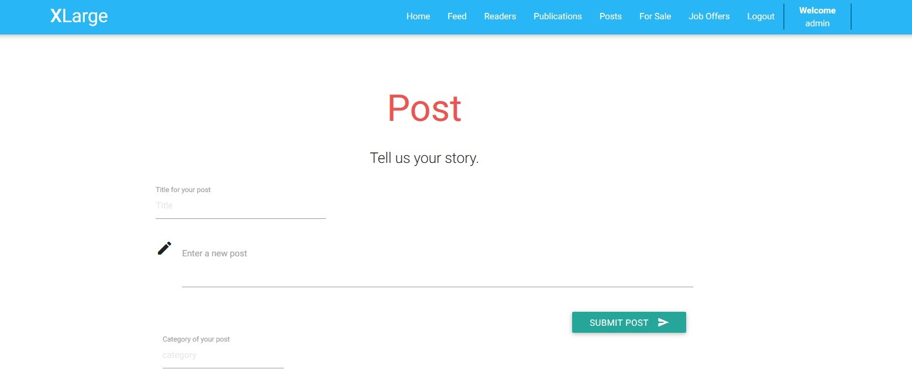
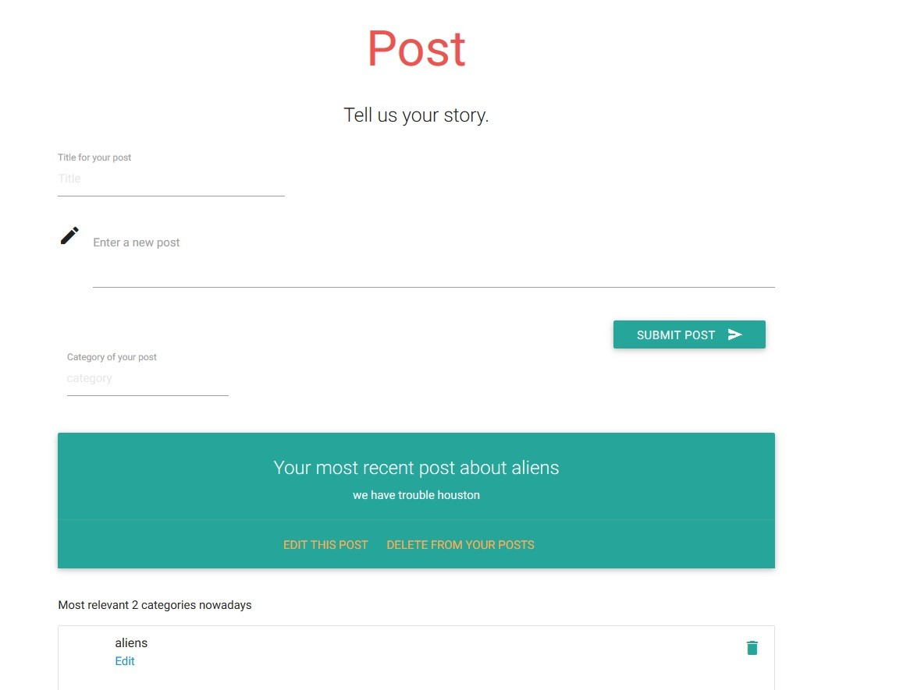

Parts Implemented by Şahin Olut
================================
Post Page
---------
The Post page is created for sending new posts for readers in XLarge.

Just writing on text boxes and clicking on the button below, post can be sent easily. This page takes your last post from database and reminds you what you wrote latest. In addition, it is possible to edit lastest post quickly by hitting edit. You are allowed to specify the category for your post.

 
 After sending new post, it can bee seen that latest post section is updated as shown above. Moreover, you can see the categories for your last 2 posts. Admins are allowed to edit data about posts and categories. Also, if a category is removed, posts with that category is removed too.
 
 .. figure:: images/sahin/3.jpg
  :scale: 35 %
  :alt: Deleting categories

In the screenshot above, aliens and Cyber Security categories are removed, so posts related to them are removed automatically too.

 .. figure:: images/sahin/4.jpg
  :scale: 40 %
  :alt: Editing post
    
Job offers
----------
    
    This page is created for recruitments for XLarge Developer and Marketing Team. It is fairly simple, there are some job opportunities that everyone can apply. Admins of XLarge are allowed to add or remove a job offer. Job offer box is contains brief information about the job title, responsibilities, working style(remote or office), location and salary. It is really straightforward and it is very similiar to book sale page.
    
 .. figure:: images/sahin/5.jpg
    :scale: 25 %
    :alt: Job offering page
